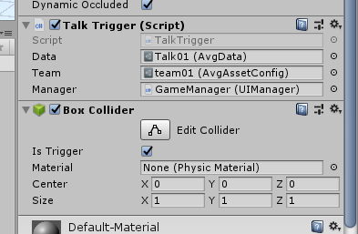
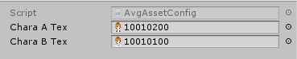
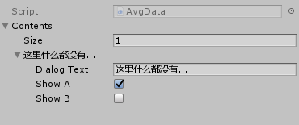

# 大创项目-成都信息工程大学3D交互漫游系统的设计和实现

> 基于Unity 2018.3.6f1 Personal
>
> 程序：[chaojie](http://www.zhaocj.top/)
>
> 参考：[傅老師MrFu](https://space.bilibili.com/211153830/)

## 人物控制

修改unity资源包人物控制和动画，默认行走，按住`shift`奔跑，如果要修改这个行为

```diff
// ThirdPersonUserControl.cs
-- m_Move *= 0.5f;
#if !MOBILE_INPUT
			// walk speed multiplier
--	        if (Input.GetKey(KeyCode.LeftShift)) m_Move *= 2f;
++            if (Input.GetKey(KeyCode.LeftShift)) m_Move *= 0.5f;
#endif
```

## 场景交互

需要交互的物体，加上如下组件



Team槽为对话头像资源，通过`右键-Create-Avg asset config`创建一个头像资源



A为右侧头像，B为左侧头像

Data槽为对话资源，通过`右键-Create-AVG Data`创建一个对话资源



`Size`为对话长度，每一个元素为一句对话，`Show A/B`表示这句对话出现哪个头像

